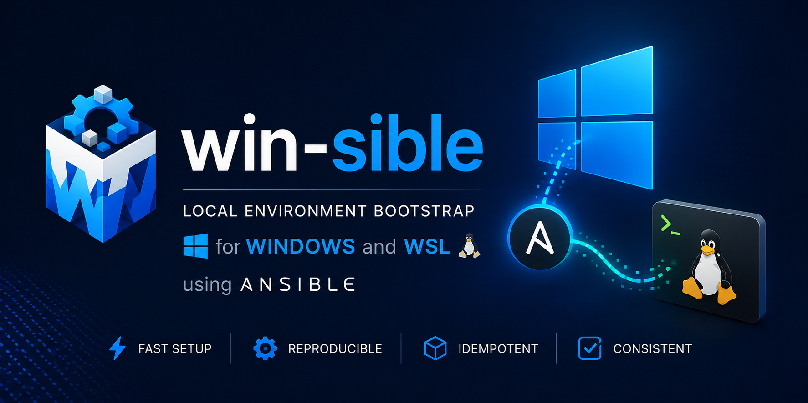

# win-sible

Automated local environment setup for Windows + WSL using PowerShell and Ansible.

This repository bootstraps a Windows development machine, configures core tooling, and applies repeatable Linux environment configuration inside WSL via Ansible playbooks.

## Why This Project

- Standardize local developer workstation setup
- Reduce manual onboarding steps
- Keep Windows and WSL setup automated and reproducible
- Separate baseline, development, and cloud-focused configuration stages

## Features

- Interactive Windows bootstrap script (`windows/bootstrap.ps1`) that can:
  - Install and upgrade Windows apps via Winget
  - Configure global Git identity
  - Configure OpenSSH client/server and generate SSH keys
  - Install and configure a WSL distro
- Ansible-driven WSL provisioning with staged playbooks:
  - Base setup
  - Development tools setup
  - Cloud tooling setup
- Makefile targets for a consistent command interface

## Project Structure

```text

win-sible/
├─ assets/
│  └─ win-sible.png
├─ dotfiles/
│  ├─ .config/
│  │  ├─ starship.lua
│  │  └─ starship.toml
│  ├─ .pwsh/
│  │  └─ Microsoft.PowerShell_profile.ps1
│  └─ windows-terminal-settings.json
├─ windows/
│  ├─ bootstrap.ps1
│  ├─ configuration.dev.yaml
│  └─ configuration.gaming.yaml
├─ wsl/
│  └─ ansible/
│     ├─ group_vars/
│     │  ├─ all.yaml
│     │  ├─ cloud.yaml
│     │  └─ dev.yaml
│     ├─ inventory/
│     │  └─ local.ini
│     ├─ playbooks/
│     │  ├─ roles/
│     │  │  ├─ cloud/
│     │  │  │  ├─ tasks/
│     │  │  │  │  └─ main.yaml
│     │  │  │  └─ templates/
│     │  │  │     └─ databricks.cfg.j2
│     │  │  ├─ common/
│     │  │  │  └─ tasks/
│     │  │  │     └─ main.yaml
│     │  │  ├─ devtools/
│     │  │  │  ├─ defaults/
│     │  │  │  │  └─ main.yaml
│     │  │  │  └─ tasks/
│     │  │  │     └─ main.yaml
│     │  │  ├─ docker/
│     │  │  │  └─ tasks/
│     │  │  │     └─ main.yaml
│     │  │  ├─ git/
│     │  │  │  └─ tasks/
│     │  │  │     └─ main.yaml
│     │  │  ├─ shell/
│     │  │  │  └─ tasks/
│     │  │  │     └─ main.yaml
│     │  │  ├─ ssh/
│     │  │  │  └─ tasks/
│     │  │  │     └─ main.yaml
│     │  │  └─ wsl/
│     │  │     └─ tasks/
│     │  │        └─ main.yaml
│     │  ├─ base.yaml
│     │  ├─ cloud.yaml
│     │  └─ dev.yaml
│     └─ ansible.cfg
├─ Makefile
└─ README.md

```

## Prerequisites

- Windows 10 or Windows 11
- PowerShell
- Internet connection
- Administrator privileges (the bootstrap script self-elevates when needed)
- `make` available on Windows

## Quick Start

Run from the repository root.

```powershell
make bootstrap
make wsl-base
make wsl-dev
make wsl-cloud
make rsync
```

## Make Targets

| Target | Description |
| ------ | ----------- |
| `make help` | Show available targets |
| `make bootstrap` | Run Windows bootstrap script |
| `make wsl-base` | Run base WSL Ansible playbook |
| `make wsl-dev` | Run development WSL Ansible playbook |
| `make wsl-cloud` | Run cloud WSL Ansible playbook |
| `make wsl-rsync` | Sync this repo from Windows into WSL path |

## Configuration

The `Makefile` supports these key variables:

- `WSL_DISTRO` (default: `Ubuntu-22.04`)
- `WSL_USER` (default: `YourWSLUserNameHere`)
- `WINDOWS_USER` (default: current `%USERNAME%`)
- `WSL_SIBLE_DIR` (default: `/root/.automation`)

Override variables inline when running `make`:

```powershell
make wsl-base WSL_DISTRO=Ubuntu-24.04 WSL_USER=<your-user>
```

## Typical Workflow

1. Run Windows bootstrap (`make bootstrap`) and complete desired interactive prompts.
2. Ensure your repository is available in WSL location (`make wsl-rsync` if needed).
3. Apply base Linux setup (`make wsl-base`).
4. Apply optional layers (`make wsl-dev`, `make wsl-cloud`).

## Troubleshooting

- If `make` is not found, ensure it is installed and on `PATH`.
- If Winget steps fail, rerun in an elevated PowerShell session.
- If WSL install changes were applied, restart Windows before continuing.
- If Ansible commands fail, verify the repo exists at `WSL_SIBLE_DIR` inside the target distro.
- If SSH setup fails in elevated PowerShell, confirm OpenSSH capabilities are installed and `ssh-keygen.exe` is present.

## Security Notes

- Review generated SSH public keys before adding them to remote services.
- Keep private keys in `%USERPROFILE%\.ssh` secure and do not share them.
- Review all bootstrap prompts before accepting changes.

## Contributing

1. Create a feature branch.
2. Keep changes scoped and documented.
3. Validate relevant `make` targets.
4. Open a pull request with a clear summary and test notes.
